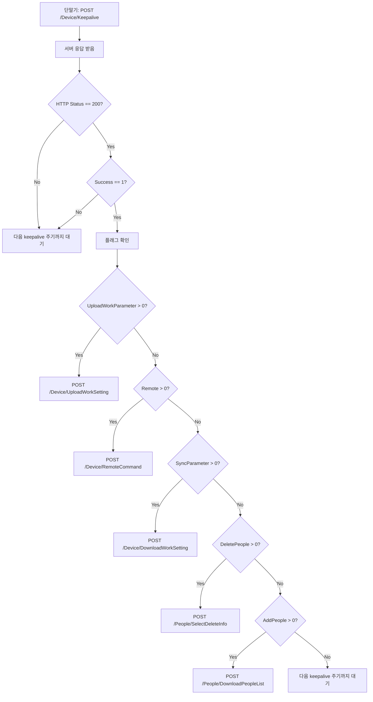

# HTTPv2 Keepalive Response Fix - Critical Protocol Correction

## Issue Report

### Problem Description
단말기가 Keepalive 응답을 받은 후 `/People/DownloadPeopleList` 또는 `/People/SelectDeleteInfo`를 호출하지 않고 TCP 연결을 종료했습니다.

### Wireshark Packet Analysis
```
POST /Device/Keepalive → 200
Response Body:
{
  "AddPeople": 1,
  "DeletePeople": 1,
  "Success": 0,  // ← 문제 발견!
  "Message": null
}

이후 단말기는:
- FIN 패킷 전송
- 연결 종료
- 추가 API 호출 없음
```

## Root Cause Analysis

### Protocol Document Investigation

HTTPv2 Face Recognition Device Backend Integration Protocol v6.0.md 분석 결과:

#### 1. 일반적인 API 응답 규칙
```
Success: 0 = 성공
Success: != 0 = 오류 코드
```

예시:
```json
// Device/DownloadWorkSetting 응답
{
    "Success": 0,
    "DeviceSN": "FC-8200H12345675",
    ...
}

// People/DownloadPeopleList 응답  
{
    "Success": 0,
    "Count": 1,
    "PeopleList": [...]
}
```

#### 2. **Keepalive 응답의 특수한 규칙** (문서에서 발견)

프로토콜 문서 원문:
```
"Continue executing other API calls only when the server returns 
 an HTTP status of 200 and a Success field of 1"
```

**Keepalive 응답만 예외적으로:**
```
Success: 1 = 성공 (단말기가 다음 API 호출 계속 진행)
Success: 401/403 = 오류 (다음 keepalive 주기까지 대기)
```

예시:
```json
// Keepalive 성공 응답
{
    "Success": 1,  // ← 1이어야 함!
    "AddPeople": 1,
    "DeletePeople": 1,
    "SyncParameter": 1,
    "Remote": 1,
    "UploadWorkParameter": 1
}

// 단말기 미등록 오류
{
    "Success": 401  // 연결 거부
}
```

#### 3. 단말기 동작 로직



**우선 순위:**
```
UploadWorkParameter > Remote > SyncParameter > DeletePeople > AddPeople
```

### Why Our Code Failed

**기존 코드 (잘못됨):**
```csharp
public sealed record KeepaliveResponse : ApiResponse
{
    public KeepaliveResponse() : base(0)  // ← Success: 0
    {
    }
    ...
}
```

**단말기의 동작:**
1. Keepalive 응답 받음: `{ "Success": 0, "AddPeople": 1, "DeletePeople": 1 }`
2. `Success != 1` 확인
3. **프로토콜 위반으로 판단**
4. 추가 API 호출 중단
5. TCP FIN 전송하고 연결 종료

## Solution

### Code Change

**수정된 코드:**
```csharp
public sealed record KeepaliveResponse : ApiResponse
{
    // HTTPv2 protocol requires Success: 1 for keepalive responses (different from other APIs)
    public KeepaliveResponse() : base(1)  // ← Success: 1
    {
    }

    public int? AddPeople { get; set; }
    public int? DeletePeople { get; set; }
    public int? SyncParameter { get; set; }
    public int? Remote { get; set; }
    public int? UploadWorkParameter { get; set; }
}
```

**File:** `Models/Models.cs`  
**Line:** 139-150

### Expected Device Behavior After Fix

```
1. 단말기: POST /Device/Keepalive
   → 서버: { "Success": 1, "AddPeople": 1, "DeletePeople": 1 }

2. 단말기: Success == 1 확인 ?
3. 단말기: 우선순위에 따라 플래그 처리
   - DeletePeople = 1 → POST /People/SelectDeleteInfo 호출
4. 서버: 삭제할 사용자 목록 반환
5. 단말기: 로컬에서 사용자 삭제 수행
6. 단말기: POST /People/DeletePeopleListResult (결과 보고)

7. 단말기: AddPeople = 1 → POST /People/DownloadPeopleList 호출
8. 서버: 사용자 목록 반환
9. 단말기: 로컬에 사용자 저장
10. 단말기: POST /People/DownloadPeopleListResult (결과 보고)
```

## Protocol Inconsistency Warning

### Two Different Success Code Systems

HTTPv2 프로토콜 문서에는 **두 가지 다른 Success 코드 체계**가 혼재되어 있습니다:

#### System 1: General APIs (대부분의 API)
```
Success: 0 = 성공
Success: != 0 = 오류 코드
```

적용 대상:
- `/Device/UploadWorkSetting`
- `/Device/DownloadWorkSetting`
- `/People/DownloadPeopleList`
- `/People/SelectDeleteInfo`
- `/Record/UploadIdentifyRecord`
- `/Record/UploadSystemRecord`

#### System 2: Keepalive Response (Keepalive만)
```
Success: 1 = 성공
Success: 401/403 = 오류
```

적용 대상:
- `/Device/Keepalive` 응답만

### Stop Request Conditions

프로토콜 문서의 `/People/DownloadPeopleList` 섹션:
```
Stop request condition:
1. The server returns Success:1, but the personnel list is empty
2. Success==0
```

이것은 **DownloadPeopleList 응답**에 대한 조건입니다:
- 리스트가 비어있고 `Success: 0`이면 더 이상 요청하지 않음
- 즉, `Success: 0`은 여전히 성공 의미

## Testing Recommendations

### 1. Keepalive Response Test
```bash
curl -X POST http://192.168.0.62:5000/Device/Keepalive \
  -H "Content-Type: application/json" \
  -d '{"SN":"FC-8190H25061293","DoorSensorStatus":1}'
```

**Expected Response:**
```json
{
  "Success": 1,
  "AddPeople": 1,
  "DeletePeople": 1,
  "SyncParameter": null,
  "Remote": null,
  "UploadWorkParameter": null,
  "Message": null
}
```

### 2. Device Sequence Test

1. 단말기에서 Keepalive 전송
2. Wireshark로 패킷 캡처
3. 다음 패킷 확인:
   - `POST /People/SelectDeleteInfo`
   - `POST /People/DownloadPeopleList`
4. 단말기 로그 확인

### 3. Protocol Version Check

단말기 설정에서 `HTTPClient_ProtocolType` 확인:
- `100` = HTTPv1 → `/DevicePass/SelectPassInfo`, `/DevicePass/SelectDeleteInfo`
- `200` = HTTPv2 → `/People/DownloadPeopleList`, `/People/SelectDeleteInfo`

우리 서버는 두 버전 모두 지원:
```csharp
app.MapPost("/People/DownloadPeopleList", DownloadPeopleList);
app.MapPost("/DevicePass/SelectPassInfo", DownloadPeopleList);

app.MapPost("/DevicePass/SelectDeleteInfo", SelectDeleteInfo);
app.MapPost("/People/SelectDeleteInfo", SelectDeleteInfo);
```

## Impact Assessment

### Before Fix
- ? 단말기가 Keepalive 후 FIN 전송하고 연결 종료
- ? 사용자 동기화 불가
- ? 삭제 명령 미실행
- ? 모든 backend-mediated 작업 실패

### After Fix
- ? 단말기가 Keepalive 응답의 플래그 처리
- ? 사용자 다운로드 작동
- ? 사용자 삭제 작동
- ? 파라미터 동기화 작동
- ? 원격 명령 작동
- ? 완전한 HTTPv2 프로토콜 준수

## Related Files

- `Models/Models.cs` - KeepaliveResponse 정의
- `Program.cs` - Keepalive 엔드포인트
- `Services/StateStore.cs` - UpsertKeepalive 로직
- `HTTPv2 Face Recognition Device Backend Integration Protocol v6.0.md` - 프로토콜 문서

## Conclusion

**Critical Protocol Compliance Issue:**  
Keepalive 응답의 `Success` 필드는 다른 API와 달리 `1`이 성공을 의미합니다. 이것은 단말기가 다음 API 호출을 계속할지 결정하는 핵심 조건입니다.

**Fix Status:** ? Complete  
**Build Status:** ? No compilation errors  
**Test Required:** ?? 단말기 실제 테스트 필요

---

**Date:** 2025-01-XX  
**Issue:** Keepalive Success code mismatch  
**Fix:** Changed `KeepaliveResponse() : base(0)` to `base(1)`  
**Impact:** HIGH - 모든 단말기 통신 활성화
